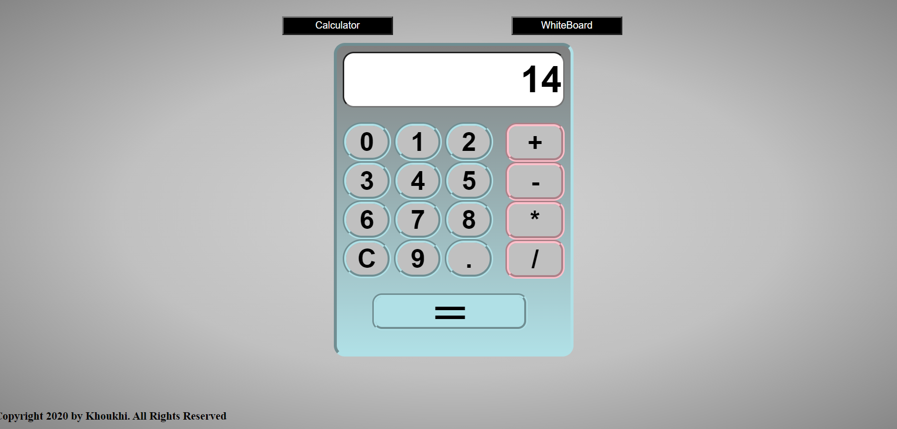
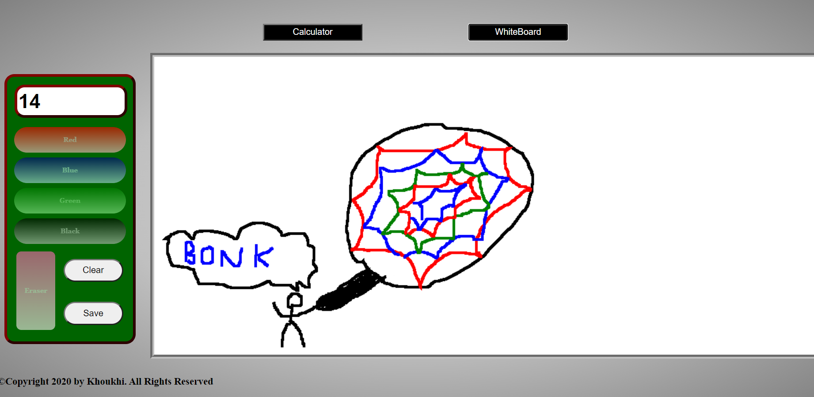

<h2>Calculator_and_Whiteboard</h2>

A minimal web application that consists of a basic calculator and a drawing whiteboard. Nothing special, just my first project using HTML, CSS, and JavaScript.  

<h3>MathTool website link:</h3> 
<a href="https://htmlpreview.github.io/?https://github.com/CookieCoder17/Mini-Web-Collection/blob/main/MathTool/MinimalMathTool.html">
Link
</a>

### Calculator:

### Whiteboard:

